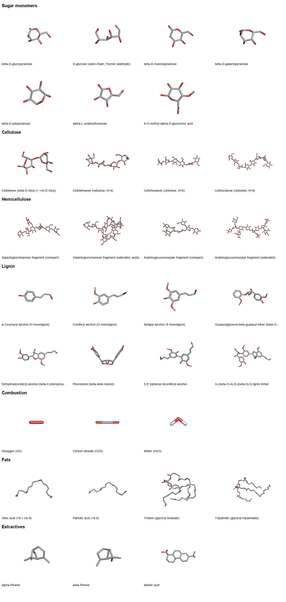

# energetics-pymol

Reproducible **3D molecular models** — PyMOL-ready `.pdb` files and ray-traced figures — of the
organic molecules that store chemical-bond energy in woody biomass, for the manuscript
**"Ecosystems as energy fields"** (Falk, Swetnam & McKenzie, 2026).

The paper estimates the embodied energy (enthalpy / higher heating value) of a *Pinus ponderosa*
forest at Gordon Gulch, CO. Because that energy lives in the molecular bonds of **cellulose,
hemicellulose, lignin** and related compounds, this repo builds clean, original 3D structures of
those molecules to illustrate where the energy is stored — replacing the third-party diagram
currently used for Figure A. The study system is a **softwood/conifer**, so the hemicellulose and
lignin models use conifer-specific chemistry (galactoglucomannan + arabinoglucuronoxylan;
guaiacyl-dominant lignin).



## Quickstart

```bash
make env                       # create the conda env (rdkit + openbabel + pymol-open-source)
conda activate energetics-pymol
make all                       # build pdb/*.pdb, render renders/*.png, write the contact sheet
```

Outputs (all committed, so you don't have to build to use them):

- `pdb/<id>.pdb` — 3D coordinates **with CONECT bond records** (drop straight into PyMOL).
- `scripts/<id>.pml` — a PyMOL script that loads + styles + ray-traces that molecule
  (`pymol scripts/cellohexaose.pml`, or `@scripts/cellohexaose.pml` in the GUI).
- `renders/<id>.png` — 300-dpi ray-traced figure; `renders/_contact_sheet.png` — the catalog above.

Build or render just one molecule: `python build_pdb.py cellohexaose && python render.py cellohexaose`.

## Molecule catalog

All structures were cross-checked against PubChem / ChEBI. Polymers are provided in **compact**
(figure-friendly) and **extended** sizes.

| category | molecules |
|----------|-----------|
| **Sugar monomers** | β-D-glucopyranose, D-glucose (open-chain), β-D-mannopyranose, β-D-galactopyranose, β-D-xylopyranose, α-L-arabinofuranose, 4-O-methyl-α-D-glucuronic acid |
| **Cellulose** | cellobiose, cellotetraose (N=4), cellohexaose (N=6), cellooctaose (N=8) — β-1,4 D-glucose |
| **Hemicellulose** (softwood) | galactoglucomannan (compact / extended+acetyl), arabinoglucuronoxylan (compact / extended) |
| **Lignin** (softwood / guaiacyl) | p-coumaryl / coniferyl / sinapyl alcohol; β-O-4, β-5, β-β (pinoresinol), 5-5 dimers; G-trimer |
| **Combustion** | O₂, CO₂, H₂O — the HHV / enthalpy-of-combustion framing (biomass + O₂ → CO₂ + H₂O) |
| **Fats** | oleic acid, palmitic acid, triolein, tripalmitin |
| **Extractives** (conifer) | α-pinene, β-pinene, abietic acid |

`python molecules.py` prints the full list with formulas. The manifest in `molecules.py` is the
single source of truth (verified SMILES, residue codes, provenance notes).

## How it works

```
molecules.py (SMILES manifest) ──▶ build_pdb.py ──▶ pdb/*.pdb ──▶ render.py ──▶ renders/*.png
        │                          (RDKit ETKDGv3                  (PyMOL -cq
        └── polymers.py             + MMFF94, CONECT)               ray-trace)
            (oligomer assembly)
```

- **RDKit** parses isomeric SMILES, embeds 3D with ETKDGv3 (fixed seed → reproducible), optimizes
  with MMFF94 (UFF fallback), and writes CONECT records. Polysaccharide/lignin oligomers are
  assembled stereo-safely in `polymers.py` (glycosidic bonds = shared SMILES ring-closure labels,
  so real bonds → real CONECT records and no chiral center is ever disturbed).
- **PyMOL** (`pymol-open-source`, headless) ray-traces each molecule as grey-carbon sticks with
  CPK heteroatoms and black outlines.

See `CLAUDE.md` for environment notes, build invariants, and how to add a molecule.

## Provenance & caveats

- Every structure is PubChem/ChEBI-verified; geometries are MMFF94-optimized (publication-quality
  cartoons, not QM-accurate energetics).
- **Lignin and hemicellulose are *defined representative* fragments**, not the true randomized
  macromolecules — caption figures as such. Softwood lignin's interunit linkages are dominated by
  β-O-4 (~50%), then β-5, β-β, and 5-5 (often within dibenzodioxocin).
- O₂ is drawn closed-shell (its ground state is a triplet diradical) for schematic clarity.

## Citation

Falk, D.A., T.L. Swetnam & D. McKenzie. *Ecosystems as energy fields* (2026, manuscript).
Built with RDKit and PyMOL (open-source).
